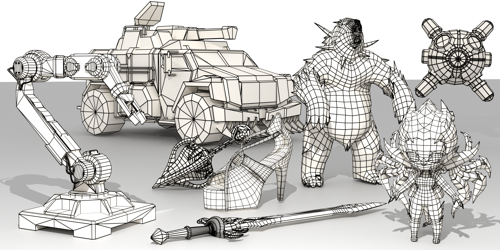

<h1 align="center">QuadLink: Autoregressive Quad-Dominant Mesh Generation via Point-Relation Learning</h1>
<!-- <h4 align="center" style="line-height:1.4; margin-top:0.6rem">
arXiv 2025
</h4> -->


<h4 align="center" style="line-height:1.4; margin-top:0.6rem">
  <a href="https://graphic-kiliani.github.io/homepage/">Yiheng Zhang</a><sup>1,2</sup>,
  <a href="https://czvvd.github.io/homepage/">Zhe Zhu</a><sup>2</sup>,
  <a href="https://trshen925.github.io">Tingrui Shen</a><sup>3</sup>,
  <a href="https://www.caizhuojiang.com/">Zhuojiang Cai</a><sup>4</sup>,
  <a href="https://github.com/tingyunaiai9">Tianxiao Li</a><sup>5</sup>,
  <a href="https://github.com/Zazexy/">Zixing Zhao</a><sup>2</sup>,
  <a href="https://qiujiedong.github.io/">Qiujie Dong</a><sup>6</sup>,
  <a href="https://frank-zy-dou.github.io/">Zhiyang Dou</a><sup>7</sup>,
  <a href="https://jiepengwang.github.io/">Jiepeng Wang</a><sup>6</sup>,
  <a href="https://openreview.net/profile?id=%7ELe_Wan1">Le Wan</a><sup>2</sup>,
  <a href="https://scholar.google.com/citations?user=KhFGpFIAAAAJ&hl=en">Yuwang Wang</a><sup>5</sup>,
  <a href="https://engineering.tamu.edu/cse/profiles/Wang-Wenping.html">Wenping Wang</a><sup>8</sup>,
  <a href="https://liuyuan-pal.github.io/">Yuan Liu</a><sup>1&dagger;</sup>,
  <a href="https://clinplayer.github.io/">Cheng Lin</a><sup>9&dagger;</sup>
</h4>

<p align="center" style="margin:0.2rem 0 0.6rem 0;">
  <sup>1</sup> Hong Kong University of Science and Technology &nbsp;&nbsp;|&nbsp;&nbsp;
  <sup>2</sup> Tencent VISVISE &nbsp;&nbsp;|&nbsp;&nbsp;
  <sup>3</sup> Peking University &nbsp;&nbsp;|&nbsp;&nbsp;
  <sup>4</sup> Technical University of Munich &nbsp;&nbsp;|&nbsp;&nbsp;
  <sup>5</sup> Tsinghua University &nbsp;&nbsp;|&nbsp;&nbsp;
  <sup>6</sup> The University of Hong Kong &nbsp;&nbsp;|&nbsp;&nbsp;
  <sup>7</sup> Massachusetts Institute of Technology &nbsp;&nbsp;|&nbsp;&nbsp;
  <sup>8</sup> Texas A&M University &nbsp;&nbsp;|&nbsp;&nbsp;
  <sup>9</sup> Macau University of Science and Technology
</p>

<p align="center" style="font-size:0.95em; color:#666; margin-top:0;">
  &dagger; Corresponding authors
</p>

<p align="center"> 
  <a href="https://arxiv.org/abs/2605.16813">
    
  </a>
  <a href="#">
    
  </a>
  <a href="https://visvise.com.cn/index">
    
  </a>
</p>


<p align="center">
  
</p>


## TODO

- [x] Release Tri-to-Quad Operator for Data Curation.
- [ ] Release code and checkpoints.


### Tri-to-Quad Operator

We provide a tool to convert artistic triangle meshes into production-ready quad-dominant meshes via **Geometry Prefiltering**, **Global Merging Selection** and **Deterministic Normal Consistency**. The technical details can be found in our paper and the installation guide can be found in [Tri-to-Quad Operator](https://github.com/Graphic-Kiliani/Tri2Quad-Geometry-Aware-Triangle-to-Quad-Mesh-Conversion-Operator/blob/main/README.md).


## Citation
If you find our work helpful, please consider citing:
```bibtex
@article{zhang2026quadlink,
  title={QuadLink: Autoregressive Quad-Dominant Mesh Generation via Point-Relation Learning},
  author={Zhang, Yiheng and Zhu, Zhe and Shen, Tingrui and Cai, Zhuojiang and Li, Tianxiao and Zhao, Zixing and Dong, Qiujie and Dou, Zhiyang and Wang, Jiepeng and Wan, Le and others},
  journal={arXiv preprint arXiv:2605.16813},
  year={2026}
}
```